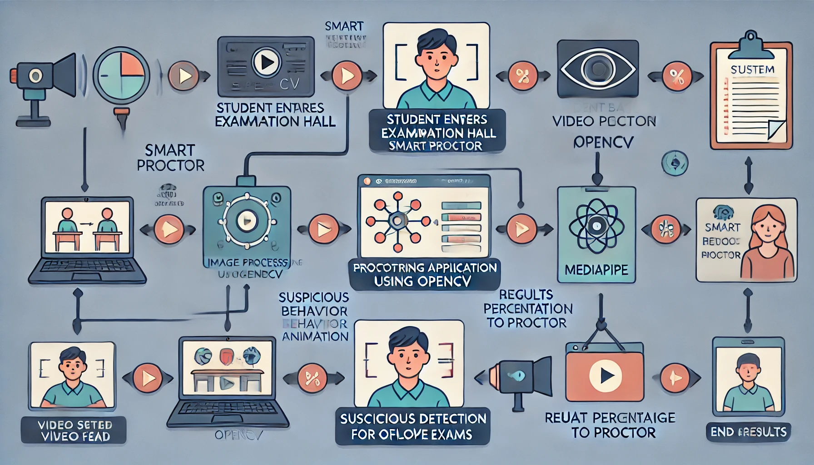

# 🎓 SPROCTOR: ML-Based Smart Proctor for Offline Exams

![GSSoC Extended]

## 📋 Table of Contents

1. [Project Overview](#project-overview)
2. [Features](#features)
3. [Technologies Used](#technologies-used)
4. [How to Contribute to This Project](#how-to-contribute-to-this-project)
5. [Contribution Points](#contribution-points)
6. [GSSoC Guidelines](#gssoc-guidelines)
7. [Thanking Our Contributors](#thanking-our-contributors)
8. [Ending Note](#ending-note)

---

## 📋 Project Overview

**SPROCTOR** is an AI-driven proctoring system designed to monitor offline exams and estimate the cheat percentage of students. It leverages cutting-edge computer vision techniques using OpenCV (CV2) and MediaPipe to detect and analyze suspicious behavior during examinations.

![SPROCTOR Model]

---

## 🎯 Problem
- **Limited proctoring resources**: Traditional human proctoring is expensive and can be difficult to scale.
- **Cheating concerns**: Online exams are vulnerable to cheating, such as students accessing unauthorized materials or communicating with others.
- **Fairness and equity**: Ensuring a fair and equitable examination environment for all students is crucial.

---

## 💡 How **SPROCTOR** solves the above problems
- **AI-driven proctoring**: SPROCTOR leverages AI to automate the proctoring process, reducing the need for human proctors.
- **Real-time monitoring**: SPROCTOR continuously monitors students' behavior during exams, detecting potential cheating activities.
- **Offline capabilities**: SPROCTOR works offline, ensuring that exams can be conducted even in areas with limited internet connectivity.

---

## 🚀 Features

- 🧠 **ML Integration:** Utilizes machine learning algorithms to assess students' actions during exams.
- 👁️ **Cheat Detection:** Estimates the likelihood of cheating based on behavior patterns.
- 📝 **Offline Proctoring:** Operates effectively without continuous internet access.

---

## 🛠️ Technologies Used

- 🐍 **Python:**  
  The primary programming language for this project, chosen for its simplicity and versatility. Python's extensive libraries, like OpenCV and MediaPipe, facilitate efficient image processing and computer vision tasks.

- 🌐 **HTML:**  
  HTML (Hypertext Markup Language) is used to structure the user interface of the application, allowing for the creation of forms, buttons, and other interactive elements that enhance user engagement.

- 📷 **OpenCV (CV2):**  
  An open-source computer vision and machine learning library that enables real-time image processing, allowing the application to capture and analyze video feeds during exams. OpenCV provides functions to detect and track objects, making it essential for identifying suspicious behavior in students.

- 🎥 **MediaPipe:**  
  A cross-platform framework for building multimodal applied machine learning pipelines. It is employed for facial and gesture recognition, enabling the application to monitor students' movements and expressions. MediaPipe's efficiency enhances the effectiveness of the proctoring system.

---

## 🚀 How to Contribute to This Project

We welcome contributions! Please refer to our [CONTRIBUTING.md](./CONTRIBUTING.md) for detailed guidelines on how to get involved.

## 📜 GSSoC Guidelines

It is important to adhere to the guidelines; violations can affect your profile. Review the guidelines [here](https://github.com/GSSoC24/Contributor/tree/main/gssoc-guidelines).

---
## 🎉Thanking Our Contributors

## ✨ Ending Note

Thank you for your interest in the **SPROCTOR** project! We believe that leveraging technology can significantly enhance the integrity of offline examinations. Your feedback and contributions are invaluable as we strive to improve this system further.

Whether you're a developer, educator, or simply curious about the project, we welcome your insights and ideas! Feel free to reach out with any questions, suggestions, or collaboration opportunities. Together, we can make the examination process fairer and more transparent for students everywhere!

## :key: License

This project is licensed under the MIT License. See the [LICENSE](LICENSE) file for details.